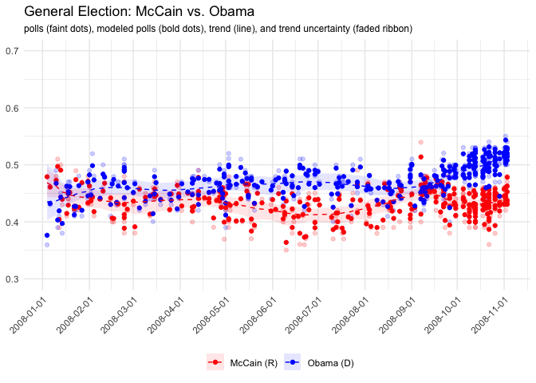
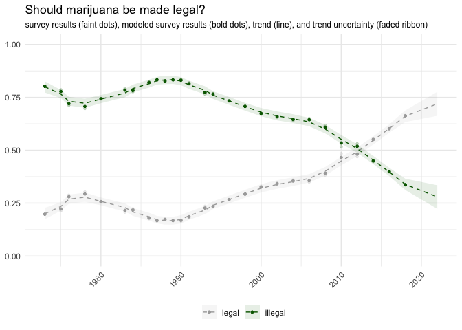

<!-- README.md is generated from README.Rmd. Please edit that file -->

# pollagg

<!-- badges: start -->

<!-- badges: end -->

`pollagg` is an out-of-the-box poll aggregator for researchers who want
to understand trends in public opinion from multiple polls or surveys
taken over time.

## Installation

You can install the development version of `pollagg` with

``` r
devtools::install_github("alexpavlakis/pollagg")
```

# Examples

The main function `yapa` (yet another poll aggregator) takes three main
arguments:

1.  `y` is a matrix of counts for responses (columns) for each poll or
    survey (rows);
2.  `n` is a vector of the total counts for each poll or survey;
3.  `dates` is a vector of dates (can be dates or numeric) for when each
    poll or survey was conducted.

An additional argument `all_dates` is available if you want to produce
specific estimates for dates other than survey dates. For example, if
you conduct surveys on the first of each month but want to estimate
hypothetical results if you had conducted them on the 15th instead.

`yapa` returns a list with:

  - `trend` a `data.frame` of the underlying trend and it’s 90%
    uncertainty interval;
  - `pct` a `data.frame` of the smoothed poll averages and their 90%
    uncertainty intervals;
  - `delta` a `data.frame` of the estimated changes in trend and their
    90% uncertainty intervals;
  - `polls` a `data.frame` of the raw polling data on which the model is
    built;
  - And other elements from the model arguments and results.

<!-- end list -->

``` r
library(pollagg)
suppressMessages(library(dplyr))
options(mc.cores = parallel::detectCores())
rstan::rstan_options(auto_write = TRUE)

# General election polls - Obama vs McCain 2008
head(obama_mccain_polls)
#> # A tibble: 6 x 5
#>   pollster         poll_end       n `McCain (R)` `Obama (D)`
#>   <chr>            <date>     <dbl>        <dbl>       <dbl>
#> 1 IBD/TIPP         2008-01-04   951          456         342
#> 2 Rasmussen        2008-01-06   800          368         344
#> 3 CNN              2008-01-10   840          403         412
#> 4 Battleground     2008-01-11   500          255         195
#> 5 Hotline/FD       2008-01-12   803          313         329
#> 6 USA Today/Gallup 2008-01-13  1106          553         498
```

In this example, we aggregate all polls conducted of the 2008
presidential race between January 1st and election day 2008. This is a
very noisy series but the model is able to pick up on the underlying
trend as well as clear breaks, such as the collapse of Lehman Brothers
on September 15th, which pushed the popular vote toward Barack Obama.

``` r

y <- select(obama_mccain_polls, `McCain (R)`, `Obama (D)`)
n <- obama_mccain_polls$n
dates <- obama_mccain_polls$poll_end

fit_polls <- yapa(y = y, n = n, dates = dates)
```

``` r
plot(fit_polls, size = 0.5) + 
  ylim(0.3, 0.6) +
  scale_x_date(date_breaks = '1 month') +
  scale_fill_manual(values = c('red', 'blue')) +
  scale_color_manual(values = c('red', 'blue')) +
  theme(axis.text.x = element_text(angle = 45, hjust = 1),
        plot.subtitle = element_text(size = 9),
        legend.position = 'bottom') +
  labs(x = NULL, y = NULL, title = 'General Election: McCain vs. Obama',
       subtitle = 'polls (faint dots), modeled polls (bold dots), trend (line), and trend uncertainty (faded ribbon)', col = NULL, fill = NULL)
```



The model can also estimate clear trends from large-sample, precise
surveys, such as trends in responses to the General Social Survey
question regarding the legality of marijuana between 1973 and 2018.

``` r
head(grass_gss)
#> # A tibble: 6 x 4
#>    year illegal legal     n
#>   <int>   <dbl> <dbl> <dbl>
#> 1  1973    1184   290  1474
#> 2  1975    1111   303  1414
#> 3  1976    1033   417  1450
#> 4  1978    1029   447  1476
#> 5  1980    1064   365  1429
#> 6  1983    1230   322  1552
```

``` r

y <- select(grass_gss, legal, illegal)
n <- grass_gss$n
dates <- grass_gss$year

fit_gss <- yapa(y = y, n = n, dates = dates)
```

``` r

plot(fit_gss) + 
  ylim(0, 1) +
  scale_fill_manual(values = c('darkgreen', 'darkgrey')) +
  scale_color_manual(values = c('darkgreen', 'darkgrey')) +
  theme(axis.text.x = element_text(angle = 45, hjust = 1),
        plot.subtitle = element_text(size = 9),
        legend.position = 'bottom') +
  labs(x = NULL, y = NULL, title = 'Should marijuana be made legal?',
       subtitle = 'survey results (faint dots), modeled survey results (bold dots), trend (line), and trend uncertainty (faded ribbon)', col = NULL, fill = NULL)
```



# Methodology

The underlying framework is a hierarchical, nonlinear model which
partially pools poll averages
()
for each option () in
each poll () toward
their trend ()
on each day (). The
trend is estimated from a baseline rate
()
and daily changes
(),
which naturally estimates nonlinear trends.

The model is fit with [Stan](www.https://mc-stan.org/).

  
 \\\\
\\theta_{p, o} &\\sim Normal(\\mu_{d(p), o}, \\sigma^\\theta) \\\\
\\mu_{d, o} &= \\sum_{t \< d} \\delta_{t, o} + \\alpha_o \\\\
\\end{align*}
")
