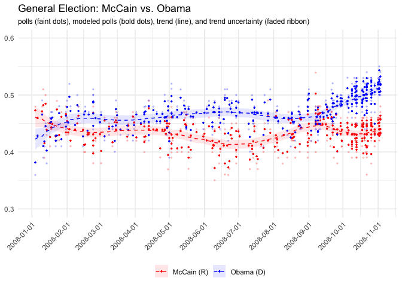
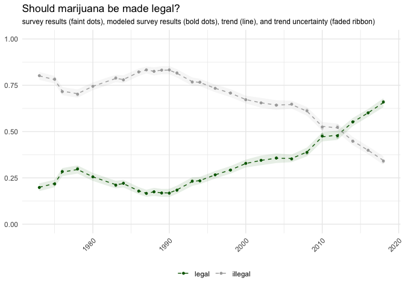

<!-- README.md is generated from README.Rmd. Please edit that file -->

# pollagg

<!-- badges: start -->

<!-- badges: end -->

`pollagg` is a tool for researchers who want to understand trends in
public opinion from many noisy polls or surveys.

## Installation

You can install the development version of `pollagg` with

``` r
devtools::install_github("alexpavlakis/pollagg")
```

# Examples

``` r
library(pollagg)
suppressMessages(library(dplyr))
library(ggplot2)

options(mc.cores = parallel::detectCores())
rstan::rstan_options(auto_write = TRUE)

# General election polls - Obama vs McCain 2008
head(obama_mccain_polls)
#> # A tibble: 6 x 5
#>   pollster         poll_end       n `McCain (R)` `Obama (D)`
#>   <chr>            <date>     <dbl>        <dbl>       <dbl>
#> 1 IBD/TIPP         2008-01-04   951          456         342
#> 2 Rasmussen        2008-01-06   800          368         344
#> 3 CNN              2008-01-10   840          403         412
#> 4 Battleground     2008-01-11   500          255         195
#> 5 Hotline/FD       2008-01-12   803          313         329
#> 6 USA Today/Gallup 2008-01-13  1106          553         498
```

``` r

y <- select(obama_mccain_polls, `McCain (R)`, `Obama (D)`)
n <- obama_mccain_polls$n
poll_dates <- obama_mccain_polls$poll_end

fit_polls <- yapa(y = y, n = n, poll_dates = poll_dates)
```

``` r

plot(fit_polls, size = 0.8) + 
  ylim(0.3, 0.7) +
  scale_x_date(date_breaks = '1 month') +
  scale_fill_manual(values = c('red', 'blue')) +
  scale_color_manual(values = c('red', 'blue')) +
  theme(axis.text.x = element_text(angle = 45, hjust = 1),
        plot.subtitle = element_text(size = 9),
        legend.position = 'bottom') +
  labs(x = NULL, y = NULL, title = 'General Election: McCain vs. Obama',
       subtitle = 'polls (faint dots), modeled polls (bold dots), trend (line), and trend uncertainty (faded ribbon)', col = NULL, fill = NULL)
```



``` r
head(grass_gss)
#> # A tibble: 6 x 4
#>    year illegal legal     n
#>   <int>   <dbl> <dbl> <dbl>
#> 1  1973    1184   290  1474
#> 2  1975    1111   303  1414
#> 3  1976    1033   417  1450
#> 4  1978    1029   447  1476
#> 5  1980    1064   365  1429
#> 6  1983    1230   322  1552
```

``` r
y <- select(grass_gss, legal, illegal)
n <- grass_gss$n
poll_dates <- grass_gss$year

fit_gss <- yapa(y = y, n = n, poll_dates = poll_dates)
```

``` r

plot(fit_gss) + 
  ylim(0, 1) +
  scale_fill_manual(values = c('darkgrey', 'darkgreen')) +
  scale_color_manual(values = c('darkgrey', 'darkgreen')) +
  theme(axis.text.x = element_text(angle = 45, hjust = 1),
        plot.subtitle = element_text(size = 9),
        legend.position = 'bottom') +
  labs(x = NULL, y = NULL, title = 'Should marijuana be made legal?',
       subtitle = 'survey results (faint dots), modeled survey results (bold dots), trend (line), and trend uncertainty (faded ribbon)', col = NULL, fill = NULL)
```



# Model

\[
\begin{align}
y_{p, o} &\sim Binomial(n_p, \theta_{p, o}) \\
\theta_{p, o} &\sim Normal(\mu_{d(p), o}, \sigma^\theta) \\
\mu_{d, o} &= \sum_{t < d} \delta_{t, o} + \alpha_o \\
\delta_{d, o} &\sim Normal(\delta_{d-1, o}, \sigma^\delta)
\end{align}
\]
